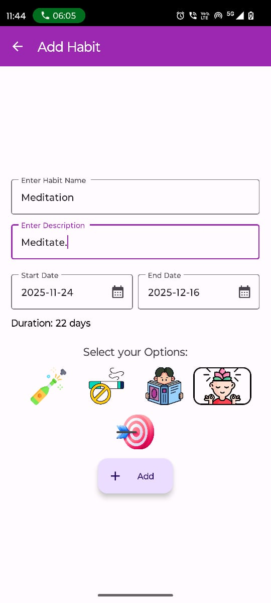
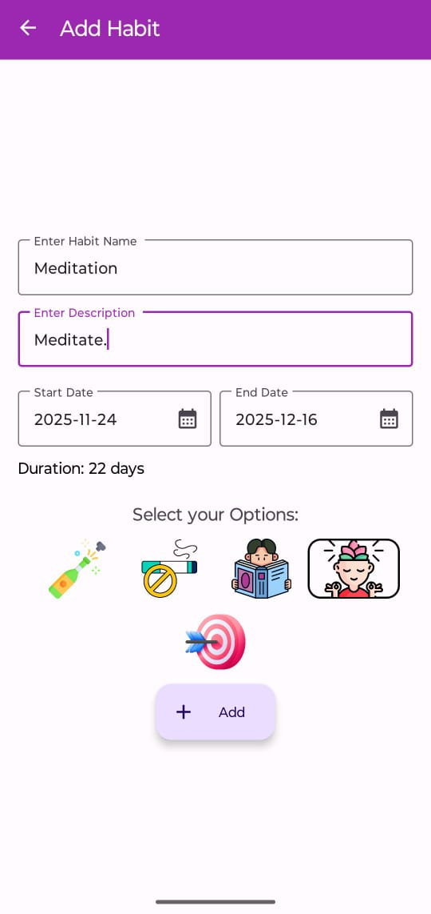
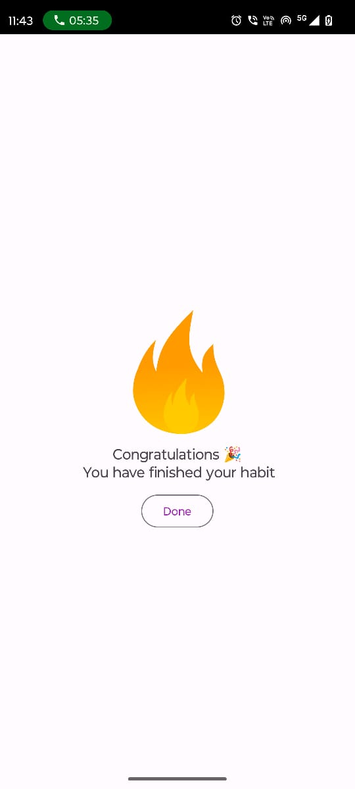

# 🧠 Habit Tracker App

A clean and modern Android application that helps you build positive habits, track daily progress, and stay consistent.  
This app allows you to create multiple habits with custom icons, select date ranges, mark daily progress, and receive a completion screen once a habit is fully achieved.  
Data is synced using **Firestore** for habits and **Realtime Database** for progress tracking.

---

## 📱 Screenshots

  
  
  

---

## 🎯 Features

- ✨ Create your own habits with name, description & category icon  
- 📅 Choose start and end dates (auto-calculates total duration)  
- ✔ Mark daily progress once per day  
- 🔁 Prevents duplicate marking (“Already marked for today”)  
- 📊 Animated progress indicator  
- 🔥 Completion screen when habit finishes  
- 📝 Edit or delete any habit  
- ⚡ Real-time syncing with Firebase  
- 🧩 Separate Firestore (habits) & Realtime Database (progress) storage  
- 🎨 Beautiful Material UI with smooth transitions  

---

## 🗄 Database Structure

### **1️⃣ Firestore — stores habit details**

